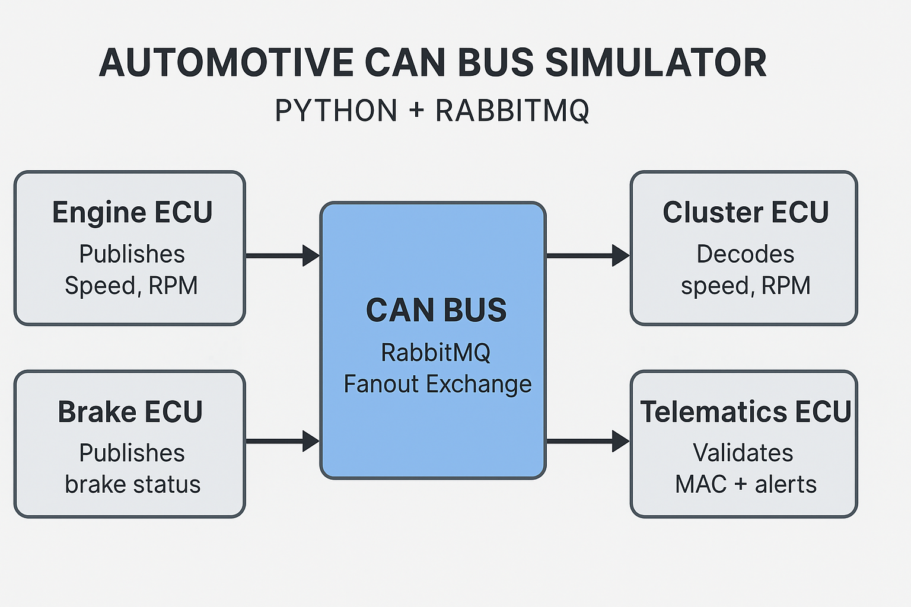

# 🚗 **Automotive CAN Bus Simulator**  
### _Python • RabbitMQ • CAN Signals • Cybersecurity • Multi-ECU System_

<p align="center">
  
</p>

<p align="center">
  <b>A modern simulation of a distributed automotive CAN Bus system with ECUs, signal encoding, MAC-based security, and RabbitMQ broadcast communication.</b>
</p>

---

<p align="center">


</p>

---

# 🧩 **Project Summary**

This project simulates a **realistic automotive CAN Bus system** using multiple ECUs written in Python, communicating via **RabbitMQ** using a fanout exchange to mimic CAN broadcast behavior.

Each ECU publishes or subscribes to CAN-style messages that contain:

- Encoded signals (Speed, RPM, Brake Status)
- SHA256 MAC (Message Authentication Code)
- CAN ID and ECU identity

The **Telematics ECU** performs cybersecurity validation & anomaly detection—similar to real connected-vehicle architecture.

This project demonstrates:

✔ CAN communication concepts  
✔ DBC-style signal processing  
✔ Multi-ECU distributed systems  
✔ Vehicle cybersecurity basics  
✔ Message integrity checks  

---

# 🏗️ **System Architecture**

```mermaid
flowchart LR
    subgraph CAN[CAN Bus Simulation (RabbitMQ Fanout Exchange)]
    end

    EngineECU[Engine ECU\nPublishes Speed + RPM]
    BrakeECU[Brake ECU\nPublishes Brake Status]
    ClusterECU[Cluster ECU\nDisplays Speed/RPM]
    TelematicsECU[Telematics ECU\nMAC Validation + Alerts]

    EngineECU --> CAN
    BrakeECU --> CAN

    CAN --> ClusterECU
    CAN --> TelematicsECU
```

---

# 📂 **Project Structure**

```yaml
automotive-can-sim/
  ├── ecus/
  │   ├── engine.py        # Publishes speed + rpm
  │   ├── brake.py         # Publishes brake status
  │   ├── cluster.py       # Displays dashboard values
  │   └── telematics.py    # Security + anomaly detection
  ├── common/
  │   └── utils.py         # Signal encode/decode + MAC generation
  ├── config/
  │   └── db.json          # Mini-DBC (signal definitions)
  ├── assets/
  │   └── architecture.png # System diagram/banner
  ├── README.md
  ├── LICENSE
  └── requirements.txt
```

---

# 🔥 **Key Features**

### 🚦 Multi-ECU Communication  
All ECUs communicate simultaneously using RabbitMQ broadcast messaging.

### 📡 Realistic Signal Encoding  
Scaling, raw bytes — like a real **DBC file**.

### 🔐 Cybersecurity (MAC Integration)  
SHA256 MAC validation performed by Telematics ECU.

### 🚨 Anomaly Detection  
Telematics ECU detects:

- High Speed  
- High RPM  
- MAC tampering  

### 🛠 Modular Architecture  
Each ECU is a standalone process—similar to real automotive embedded systems.

---

# ⚙️ **Installation**

### 1️⃣ Clone the repository
```bash
git clone https://github.com/<your-username>/automotive-can-sim.git
cd automotive-can-sim
```

### 2️⃣ Install dependencies
```bash
pip install -r requirements.txt
```

---

# 🟧 **Start RabbitMQ**

### Option A — Local installation
```bash
rabbitmq-server
```

### Option B — Docker (recommended)
```bash
docker run -d --hostname rabbit --name rabbitmq \
    -p 5672:5672 -p 15672:15672 rabbitmq:3-management
```

Dashboard → http://localhost:15672  
User: guest • Password: guest

---

# 🚀 **Run ECUs (open 4 terminals)**

```bash
python ecus/engine.py
python ecus/brake.py
python ecus/cluster.py
python ecus/telematics.py
```

Example output:
```
[ENGINE] speed=52 rpm=2100
[BRAKE] status=1
[CLUSTER] Speed=52 RPM=2100
[TELEMATICS] MAC OK
```

---

# 📸 **Screenshots / Banner**

Store images in:
```
assets/
 └── architecture.png
```

---

# 📄 **License (MIT)**

This project is licensed under the MIT License.

---

# 🤝 **Contributions**

Pull requests are welcome!

---

